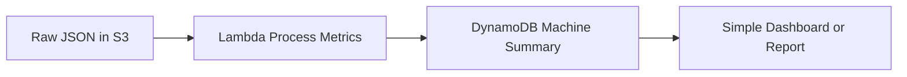

# Slushie-as-a-Service Case Study (Module 06)

## 1) Context + goal (what we’re solving)
Frazil’s business model depends on keeping machines **on**, **working**, and **ready to sell** (cold enough, not empty) while reducing retailer burden. The product should:

- Reduce retailer burden of maintaining machines
- Increase cups sold (by reducing downtime / stock-outs)
- Provide actionable insights that are easy to consume

## 2) Data used (small, simple sample)
Source dataset: `slushi docs/slushie_machines_data_huge.json`

For a simple, readable analysis, we sampled:

- **Machines**: 1, 2, 3
- **Time window**: **2024-05-29** (full day)
- **Granularity**: appears to be 5-minute readings

Fields available per reading:
`temperature`, `percentage_full`, `is_on`, `slushies_filled`, `last_cleaned`, `last_time_filter_replaced`, `timestamp`

Important interpretation used for this write-up:

- `slushies_filled` behaves like a **counter that can reset** (values can go down). We estimate “cups sold” as the **sum of positive deltas** between consecutive readings.
- “Off time” is estimated as **5 minutes per reading** where `is_on == false`.
- `last_cleaned` changes very frequently in the sample, so we treat it as **noisy/uncertain** (we use it cautiously and focus more on uptime + sales readiness).

## 3) Guiding questions (what we asked of the data)
- When are **peak hours** (highest estimated cups sold/hour)?
- Which machines have the most **downtime**, and is it happening during peak?
- Do machines risk **lost sales** by being low/empty during peak (`percentage_full` low)?
- Does temperature stay stable while machines are on (proxy for product quality readiness)?
- What “actionable” signals can be turned into **alerts** and **weekly chores** to reduce retailer burden?

## 4) Findings (simple descriptive metrics)
Sample-day summary (2024-05-29):

| machine_id | status | window | off_minutes | current_fill_pct | temp_on_avg | cups_total_est |
|---:|:---|:---|---:|---:|---:|---:|
| 1 | AtRisk | 2024-05-29 00:00→23:55 | 95 | 98.05 | 30.34 | 8,381 |
| 2 | Down | 2024-05-29 00:00→23:55 | 1,145 | 11.27 | 30.99 | 1,452 |
| 3 | AtRisk | 2024-05-29 00:00→23:55 | 65 | 33.95 | 30.15 | 3,092 |

Proof-of-concept output files:

- `sample_machine_summary.json`
- `dashboard.html`

Peak hours (by estimated cups sold):

- **Machine 1**: 12:00 (1334), 11:00 (1269), 06:00 (829)
- **Machine 2**: 05:00 (180), 11:00 (180), 06:00 (175)
- **Machine 3**: 05:00 (346), 10:00 (330), 01:00 (321)

## 5) Insights (3–5 things a manager can act on)
1) **Downtime is the biggest sales killer.**  
   Machine 2 is off ~1,145 minutes (~19 hours) in the sampled day, and also never gets above ~20% full. This machine is effectively **not selling** most of the day.

2) **Stock-outs / low fill levels likely cause lost sales even when the machine is “on.”**  
   Machine 2’s `percentage_full` stays between 0–20%. That suggests frequent empty/near-empty conditions, which is a “silent failure” (machine may be on, but customers can’t buy).

3) **Peak demand is time-clustered; refilling and checks should be scheduled.**  
   Machine 1 spikes around late morning/noon; Machine 3 peaks early morning. A dashboard that highlights the store’s “peak hour window” makes refills and checks more predictable and less reactive.

4) **Temperature looks broadly stable across machines when on (within this sample), but it’s still a strong alert signal.**  
   Average “on” temperature is ~30–31 (unit unknown). Temperature is still useful as an “is it ready?” quality proxy and for early issue detection (compressor/freezing problems).

5) **Maintenance fields are noisy; rely on observed behavior to drive actions.**  
   In the sample, `last_cleaned` changes very frequently, so it’s risky as the only source of truth. The product should drive chores from **usage + uptime + anomalies** (and treat maintenance logs as supporting metadata).

## 6) Recommendations (simple, concrete actions)
Prioritized actions for Frazil + retailers:

1) **Downtime-first playbook (fastest ROI)**  
   - Alert when `is_on == false` for > 15 minutes during business hours.
   - Escalate if > 60 minutes or repeated off cycles in 24h.

2) **Low-fill prevention**  
   - Alert when `percentage_full < 20%` during the store’s peak window.
   - Recommend “top-off” schedule (e.g., 30–60 minutes before peak hours).

3) **Temperature health**  
   - Alert when temperature is outside an acceptable range while `is_on == true` (range to be discovered with stakeholders + calibration).

4) **Actionable weekly chores (reduce retailer burden)**  
   - Auto-generate a weekly checklist: “Refill cadence,” “Quick inspection,” “Clean/filter reminders,” based on observed usage and anomalies (not just timestamps).

## 7) Product concept (what we would build)
A simple “Slushie Ops Dashboard” that answers, at a glance:

- Which machines are **Down**, **At Risk**, or **Healthy**
- How many estimated **cups sold** each sampled machine generated
- Which machines are low on product and need attention

This is a learner-lab proof of concept, so the JSON file is treated as **simulated telemetry** instead of live machine data.

## 8) Architecture (learner-lab version)
Because this project is being built in an AWS learner lab, the architecture should stay simple and easy to demo in a few hours:

### How it works
- **Amazon S3** stores the raw JSON dataset and optional processed output files.
- **AWS Lambda** reads a small sample of the JSON, calculates the key business metrics, and assigns a simple machine status.
- **Amazon DynamoDB** stores the summary output per machine so it can be displayed quickly.
- **Simple dashboard/report** shows the summary data without requiring QuickSight.

### Why this architecture fits the assignment
- **Cost optimized**: only a few low-cost AWS services are used.
- **Feasible in a few hours**: no live device integration, no advanced analytics pipeline, no unavailable learner-lab services.
- **Actionable**: directly supports the three most important questions:
  - Which machines are down?
  - Which machines are at risk of running empty?
  - Which machines are selling the most?

### Minimal machine summary fields
Each machine summary should store only:

- `machine_id`
- `status`
- `off_minutes`
- `percentage_full`
- `temp_avg`
- `cups_total_est`

### Simple status rules
- **Down**: machine has high downtime in the sample window
- **AtRisk**: machine is low on product or has concerning temperature behavior
- **Healthy**: machine is on, reasonably full, and not showing obvious issues

## 9) How this maps to the case study phases
- **Product discovery**: identify the most useful machine-health insights from the JSON data
- **Requirements**: define the minimum metrics and status rules for the dashboard
- **Architecture**: implement the learner-lab flow shown above
- **Proof of concept**: show a simple status view for 2-3 machines from a one-day sample
- **User feedback**: ask whether the output is clear enough for a store manager
- **Updates**: refine status thresholds or summary fields if time allows
- **Presentation**: show the architecture, sample output, and recommendations

